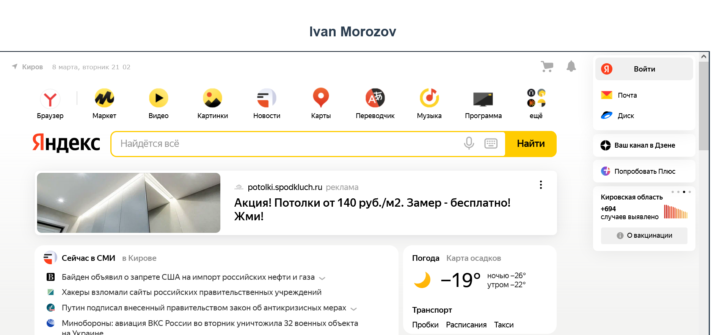

<p align = center>МИНИСТЕРСТВО НАУКИ И ВЫСШЕГО ОБРАЗОВАНИЯ

<p align = center>РОССИЙСКОЙ ФЕДЕРАЦИИ

<p align = center>ФЕДЕРАЛЬНОЕ ГОСУДАРСТВЕННОЕ БЮДЖЕТНОЕ ОБРАЗОВАТЕЛЬНОЕ УЧРЕЖДЕНИЕ ВЫСШЕГО ОБРАЗОВАНИЯ

<p align = center>«ВЯТСКИЙ ГОСУДАРСТВЕННЫЙ УНИВЕРСИТЕТ»

<p align = center>Институт математики и информационных систем

<p align = center>Факультет автоматики и вычислительной техники

<p align = center>Кафедра систем автоматизации управления

<p align = right>Дата сдачи на проверку:

<p align = right>«___» __________ 2022 г.

<p align = right>Проверено:

<p align = right>«___» __________ 2022 г.

<p align = center>Отчет по лабораторной работе № 1

<p align = center>по дисциплине

<p align = center>«Web-программирование»

<p align = center>Вариант 1


<p align = center>Разработал студент гр. ИТб-2301-01-00 ________________ /Морозов И.В./

<p align = center>Проверил ст. преподаватель _________________ /Земцов М.А./

<p align = center>Работа защищена с оценкой «___________» «___» __________ 2022 г.


<p align = center>Киров 2022

__________
Цель: ознакомиться с веб-фреймворк Vue

Задачи:

1. Организовать процесс работы над лабораторной работой
1. Подключить веб-фреймворк VUE
1. Подключить сборщик модулей Webpack
1. Подключить и изучить библиотеку Axios
1. Ознакомиться с языком программирования TypeScript
1. Вывести фамилию, имя автора
1. Отобразить сайт на странице

Ход выполнения:

1. Организовать процесс работы над лабораторной работой

Создан репозиторий на сайте github.com с названием “WEB_2K”. В нем создана ветка Lab1.

Ссылка на данный репозиторий представлена ниже.

*[ссылка на репозиторий](https://github.com/Ivan2567/WEB_2K/)*

2. Подключить веб-фреймворк VUE

Для подключения необходимо изучить Node.js, который предоставляет большой набор встроенных API, которые помогают создавать различные типы приложений, приложения командной строки, веб-приложения и многое другое. Он также предлагает возможности тестирования и отладки и обширную экосистему пакетов сторонних разработчиков, которые можно легко добавлять в приложение.

Node.js является средой выполнения JavaScript, которая использует один цикл событий для параллельных задач.

К новому проекту в редакторе Visual Studio Code с помощью node был подключен веб-фреймворк VUE. Листинг App.vue пресдтавлен в приложении А.

3. Подключить сборщик модулей Webpack

Webpack — это статический сборщик модулей. Его основная задача — пакетирование файлов JavaScript для использования в браузере, но он также способен преобразовывать, связывать и упаковывать практически любые ресурсы.

К текущему проекту был подключен сборщик модулей Webpack с помощью команды npm install.

<p align = center>2

__________

4. Подключить и изучить библиотеку Axios

Axios — это широко известная JavaScript-библиотека. Она представляет собой HTTP-клиент, основанный на промисах и предназначенный для браузеров и для Node.js.


К текущему проекту была подключена библиотека Axios с помощью node.

5. Ознакомиться с языком программирования TypeScript

TypeScript — это язык программирования, в котором исправлены многие недостатки JavaScript. TypeScript является надмножеством языка JavaScript. TypeScript включает функции кода, несовместимые с браузером.

Для установки компилятора TypeScript была применена команда npm install -g typescript.

6. Вывести фамилию, имя и отчество автора

В ходе работы был создан Node модуль c названием get-my-myname. В этом модуле был добавлен файл index.js. Листинг данного файла представлен в приложении Б. Отображение фамилии и имени представлено на риссунке 1.

7. Отобразить сайт на странице

В ходе работы был создан Vue проект  и в него добавлен компонент vtsu.vue. Листинг данного компонента представлен в приложении В. Фрейм с сайтом Яндекса представлен на риссунке 1.

<p align=center></p>

<p align = center>Рисунок 1 – Страница, отображающая ФИО и сайт Яндекс 

Вывод: в ходе лабораторной работы были изучены: веб-фреймворк VUE, сборщик модулей Webpack, библиотека Axios, язык программирования TypeScript. С помощью перечисленных компонентов на практике реализовано отображение на странице фамилии, имени, отчества и сайта.

<p align = center>3

__________

<p align = center>Приложение А

<p align = center>(обязательное)

<p align = center>Листинг компонента App.vue

```html
<template>
    <div id='app'>
        <h2>{{ myname}}</h2>
        <vtsu :page = "page"></vtsu>
        <regform></regform>
    </div>
    
</template>

<script lang="ts">
//import Vue from 'vue';
import vtsu  from '../../vt-su/src/components/vtsu.vue'
import regform from '../../regform/src/components/regf.vue'
declare var require: any;
import { defineComponent } from 'vue';
import axios from 'axios';
var url = 'https://yandex.ru/';
export default defineComponent({
name: 'App',
components: {vtsu, regform},
data(){
  return{
      myname: require('get-my-myname'),page:[]
      };
    },
    mounted(){
      axios
      .get(url,
      { headers: {"Access-Control-Allow-Origin" : "https://yandex.ru/" },
      withCredentials: false,}
    ).then((response: any) =>
        {this.page = response.data;},
        ); 
  }, 
  });
</script> 
```
<p align = center>4

__________

<p align = center>Приложение Б

<p align = center>(обязательное)

<p align = center>Листинг файла index.js

```ts
const myname = 'Ivan Morozov'; 
module.exports = myname;
```

<p align = center>5

__________

<p align = center>Приложение B

<p align = center>(обязательное)

<p align = center>Листинг компонента vtsu.vue

```html
<template>
 <iframe :srcdoc="page" class="frame" id="frame"></iframe>
</template>
<script lang="ts">
export default {
  props: {
    page: [],
  },
};
</script>
<style>
.frame{
    width: 100%;
    height: 600px;
    }
</style>
```
<p align = center>6

______
<p align = center>Приложение Г

<p align = center>(справочное)

<p align = center>Библиографический список

- <https://docs.microsoft.com/ru-ru/learn/paths/vue-first-steps/>
- <https://docs.microsoft.com/ru-ru/learn/paths/build-javascript-applications-nodejs/>
- <https://docs.microsoft.com/ru-ru/learn/paths/build-javascript-applications-typescript/>
- <https://skillbox.ru/media/code/typescript_kak_s_nim_rabotat_i_chem_on_otlichaetsya_ot_javascript/>
- <https://habr.com/ru/company/ruvds/blog/477286/>
- <https://medium.com/nuances-of-programming/введение-в-webpack-для-новичков-6cafbf562386>

<p align = center>7
