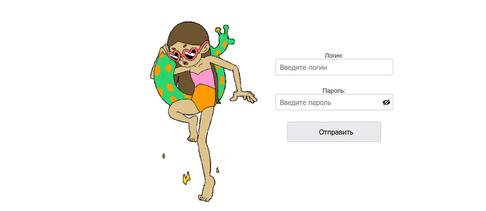
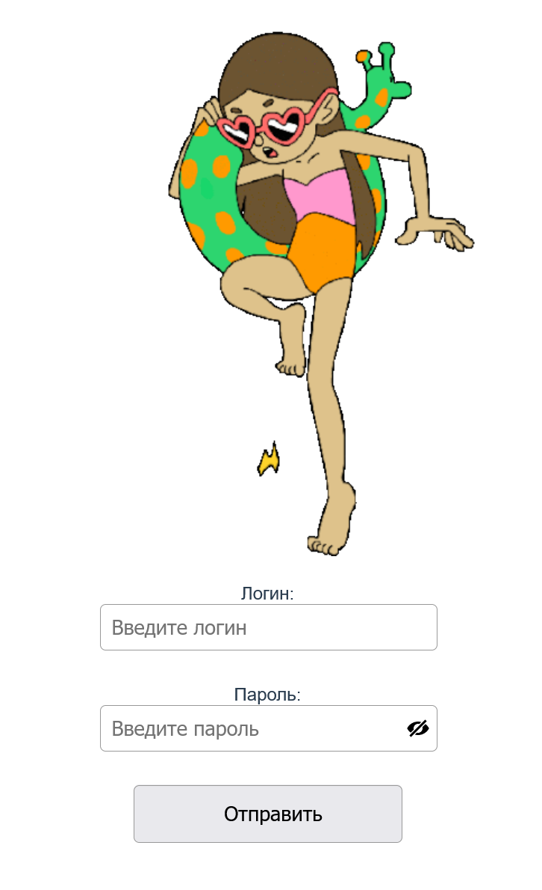

<p align = center>МИНИСТЕРСТВО НАУКИ И ВЫСШЕГО ОБРАЗОВАНИЯ

<p align = center>РОССИЙСКОЙ ФЕДЕРАЦИИ

<p align = center>ФЕДЕРАЛЬНОЕ ГОСУДАРСТВЕННОЕ БЮДЖЕТНОЕ ОБРАЗОВАТЕЛЬНОЕ УЧРЕЖДЕНИЕ ВЫСШЕГО ОБРАЗОВАНИЯ

<p align = center>«ВЯТСКИЙ ГОСУДАРСТВЕННЫЙ УНИВЕРСИТЕТ»

<p align = center>Институт математики и информационных систем

<p align = center>Факультет автоматики и вычислительной техники

<p align = center>Кафедра систем автоматизации управления

<p align = right>Дата сдачи на проверку:

<p align = right>«___» __________ 2022 г.

<p align = right>Проверено:

<p align = right>«___» __________ 2022 г.

<p align = center>Отчет по лабораторной работе № 2

<p align = center>по дисциплине

<p align = center>«Web-программирование»

<p align = center>Вариант 2


<p align = center>Разработал студент гр. ИТб-2301-01-00 ________________ /Морозов И.В./

<p align = center>Проверил ст. преподаватель _________________ /Земцов М.А./

<p align = center>Работа защищена с оценкой «___________» «___» __________ 2022 г.


<p align = center>Киров 2022

__________
Цель:  отобразить на странице адаптивный блок авторизации

Задачи:

1. Организовать процесс работы над лабораторной работой
1. Отобразить блок авторизации на странице

Ход выполнения:

1. Организовать процесс работы над лабораторной работой

Для работы в репозитории *[ссылка на репозиторий](https://github.com/Ivan2567/WEB_2K/)* на сайте github.com от ветки Lab1 создана новая ветвь с названием Lab2. Cоздан Vue проект c названием regform. В этом проекте был добавлен компонент regf.vue.

2. Отобразить блок авторизации на странице

В ходе выполнения работы был реализован блок регистрации для компьютерной версии сайта, который содержит в себе: большой логотип, который распологается слева, два поля ввода для логина и пароля с кнопкой смены видимости. Отображаемый на странице блок авторизации представлен на рисунке 1.

<p align=center></p>

<p align = center>Рисунок 1 – Блок регистрации для компьютерной версии сайта

Для мобильной версии сайта на странице присутствуют все те же компоненты, что и для компьютерной. Блок авторизации для мобильных устройств отображен на рисунке 2.


<p align=center></p>

<p align = center>Рисунок 2 – Блок регистрации для мобильной версии сайта

Листинг компонента Login.vue представлен в приложении А.

Вывод: в ходе лабораторной работы организовано рабочее пространство, закреплены навыки работы с веб-фреймворком VUE. Также были освежены знания языков разметки html и css. На практике реализован адаптивный блок авторизации.

<p align = center>2

__________

<p align = center>Приложение А

<p align = center>(обязательное) 

<p align = center>Листинг компонента regf.vue

```html
<template>
<div class="container">
<div class= "img_block"></div>
    <div class="form_block">
        <div class="login_block">
        <label>Логин:</label>
        <div class="login">
            <input id="login-input" type="text" placeholder="Введите логин" >
        </div>
        </div>

        <div class="password_block">
        <label>Пароль:</label>
        <div class="password">
            <input type="password" id="password-input" placeholder="Введите пароль" name="password">
            <button v-on:click="showOrHide" id="password-control" class="password-control"></button>
        </div>
        </div>

        <div class="btn">
        <input id="btn-input" type="button" value="Отправить">
        </div>
    </div>
</div>
</template>

<script lang="ts">
import { defineComponent } from 'vue';

export default defineComponent({
name: 'App',
components: {
},
methods:{
            showOrHide: function(){
                const input = document.getElementById('password-input');
                const image = document.getElementById('password-control');
                
                if (input != null && image != null) {
                if (input.getAttribute('type') == 'password') {
                    input.setAttribute('type', 'text');
                    image.classList.add('view');
                }
                else {
                    input.setAttribute('type', 'password');
                    image.classList.remove('view');
                }
                return false;
                }
            return false;
            }  
            }
});
</script>

<style>
#app {
font-family: Avenir, Helvetica, Arial, sans-serif;
-webkit-font-smoothing: antialiased;
-moz-osx-font-smoothing: grayscale;
text-align: center;
color: #2c3e50;
margin-top: 60px;
}

.container {
    display: flex;
    align-items: center;
    justify-content: center;
    flex-direction: row;
}

.img_block {
    padding: 20px;
}

.form_block, .login_block, .password_block {
    display: flex;
    justify-content: center;
flex-direction: column;
margin-bottom: 30px;
}

.password, .login, .btn {
    text-align: center;
    width: 300px;
    position: relative;
}
#password-input, #login-input, #btn-input {
    width: 100%;
    padding: 5px 0;
    height: 30px;
    line-height: 40px;
    text-indent: 10px;
    border-radius: 5px;
    border: 1px solid #999;
    font-size: 18px;
}

#btn-input {
    width: 80%;
    padding: 5px 0;
    height: auto;
    line-height: 40px;
    text-indent: 10px;
    margin: 0 0 15px 0;
    border-radius: 5px;
    border: 1px solid #999;
    font-size: 18px;
}

.password-control {
    position: absolute;
    top: 11px;
    right: 6px;
    display: inline-block;
    width: 20px;
    height: 20px;
    background: url(https://snipp.ru/demo/495/no-view.svg) 0 0 no-repeat;
    border: 0;
}
.password-control.view {
    background: url(https://snipp.ru/demo/495/view.svg) 0 0 no-repeat;
}


@media (max-width: 580px) { 
    .container {
        display: flex;
        align-items: center;
        justify-content: center;
        flex-direction: column;
    }
}
</style>
```